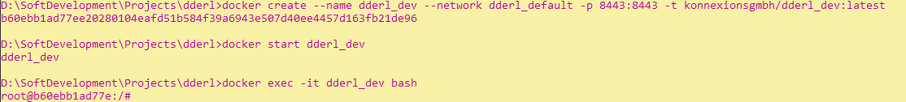
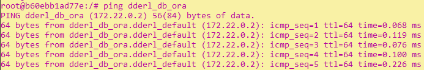
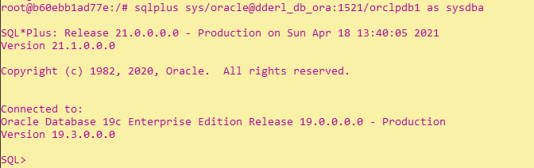
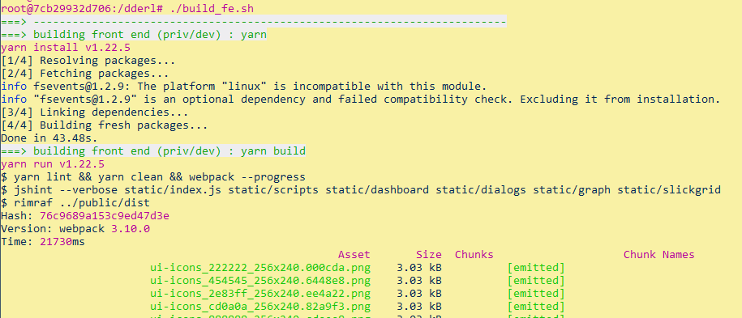
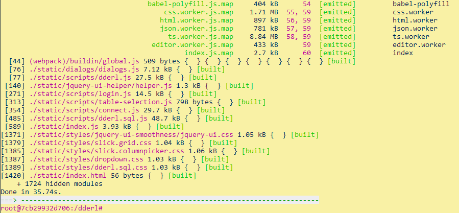

Buidling DDErl.
=====
``
## Table of Contents

**[1. Prerequisites](#prerequisites)** 
**[2. Building DDErl](#buildinf_dderl)** 
**[2.1 Building On Operating System Level](#building_on_operating_system_level)** 
**[2.2 Building Using Docker Containers](#building_using_docker_containers)** 

----

##  1. Prerequisites

Building DDErl is only supported for Unix and similar systems.
All instructions have been tested with Ubuntu 20.04 (Focal Fossa). 

The following software components are required in addition to a Unix operating system:

| Component | From Version  | Source                                             |
| --------- | ------------- | ---------------------------------------------------|
| Erlang    | 23.3.1        | https://erlang.org/download/otp_versions_tree.html |
| gcc       | 10.2.0        | https://gcc.gnu.org/                               |
| git       | 2.31.1        | https://git-scm.com/                               | 
| GNU make  | 4.3           | https://www.gnu.org/software/make/                 |
| rebar3    | V3.14.3       | https://www.rebar3.org/                            |
| Yarn      | 1.22.10       | https://github.com/yarnpkg/yarn                    |

##  2. Building DDErl

The build process can either be done directly on the operating system level or based on the Konnexions development image.
For the former, all the software components mentioned under section 1 must be installed, for the latter they are already pre-installed in the image.
In addition, a Docker compose script is available that combines the Konnexions development image with an empty Oracle database. 
This can be used as an easily customizable template.

##  2.1 Building On Operating System Level

### 2.1.1 Download the DDErl repository from GitHub:

    git clone https://github.com/KonnexionsGmbH/dderl`

### 2.1.2 Change to the DDErl directory

    cd dderl

### 2.1.3 Create the frontend to `DDErl`:

    cd priv/dev
    yarn install-build-prod

### 2.1.4 Build alternatively

#### either backend and frontend:

    rebar3 as ui compile

#### or backend only:

    rebar3 compile

#### or frontend only:

    bash ./build_fe.sh

##  2.2 Building Using Docker Containers

The use of Konnexions development image makes the build process independent of the host operating system.
The only requirement is the installation of Docker Desktop and possibly Docker Compose (Unix operating systems).
The following instructions demonstrate how to use the Docker compose script. 

### 2.2.1. Building DDErl with Docker Compose in the DDErl root directory

This command installs an executable DDErl:

    docker-compose up -d
    
**Sample output:**    
    

The following processing steps are performed:
1. If not already there, download the Oracle database image and create the container `dderl_db_ora` with an Oracle database (currently 19c).
2. If not yet available, download the Konnexion development image and create the corresponding container `dderl_dev`.
3. Both containers are assigned to network `dderl_dev_net`.
4. After the database is ready, the schema `scott` is created with the password `regit` (only with a new database container). 
5. The repository `https://github.com/KonnexionsGmbH/dderl` is downloaded from Github (only with a new development container).
6. The frontend to `DDErl` is created (only with a new development container).
7. `DDErl` is compiled and started.
   
### 2.2.2. Building DDErl manually

#### 2.2.2.1 Enter the Konnexions development container:

    docker exec -it dderl_dev bash
    
**Sample output:**    
    
    

Inside the  development container `dderl_dev` the database container `dderl_db_ora` can be addressed with the `dderl_db_ora` as hostname:  

    ping dderl_db_ora

#### 2.2.2.2 Optionally the database can be set up
    
    sqlplus sys/oracle@dderl_db_ora:1521/orclpdb1 as sysdba
    

    
    create user scott identified by regit;
    grant alter system to scott;
    grant create session to scott;
    grant unlimited tablespace to scott;
    grant create table to scott;
    grant create view to scott;
    exit

 

#### 2.2.2.3 Next you need to download the DDErl repository from GitHub:

    git clone https://github.com/KonnexionsGmbH/dderl
    cd dderl
    
**Sample output:**   
 

#### 2.2.2.4 Then the frontend to `DDErl` has to be created:

    ./build_fe.sh
    
**Sample output - start:**    
    
    
    
**Sample output - end:**    
    

#### 2.2.2.5 Now you can either execute one of the commands from section 2.1 point 4 or start DDErl directly with `rebar3 shell`:

    rebar3 shell
    
**Sample output - start:**    
    

**Sample output - end:**    
    

### 2.2.3 Finally DDErl is ready and can be operated via a Browser

#### Login screen:

User: `system` Password: `change_on_install`

#### Database connection:

|           |                     |
| ---       | ---                 |
| Service   | **`orclpdb1`**      |
| Host / IP | **`ddeerl_db_ora`** |
| Port      | **`1521`**          |
| User      | **`scott`**         |
| Password  | **`regit`**         |

##### Start browsing:

